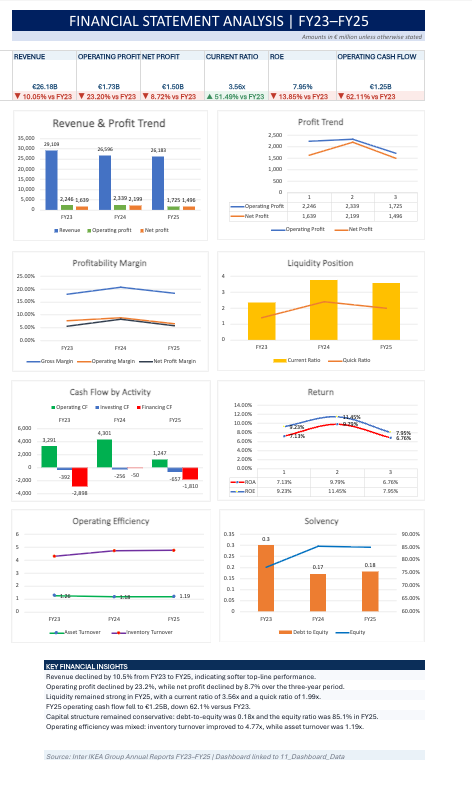

# Inter IKEA Group Financial Statement Analysis (FY23–FY25)


## Project Overview

This independent portfolio project evaluates the financial performance and financial position of **Inter IKEA Group (Inter IKEA Holding B.V.)** across FY23, FY24, and FY25.

The project converts publicly available consolidated financial statements into a structured Microsoft Excel model containing:

- standardized income statement, balance sheet, and cash-flow statement data;
- profitability, liquidity, solvency, efficiency, return, and cash-conversion ratios;
- three-year trend analysis and written financial interpretations;
- an executive dashboard presenting the principal findings.

Inter IKEA Group's financial year runs from **1 September to 31 August**. All monetary amounts in this project are presented in **EUR millions**, unless otherwise stated.

> **Important scope note:** Inter IKEA Group is not the same as the entire IKEA franchise system. The financial figures analyzed here relate to Inter IKEA Holding B.V. and its consolidated subsidiaries, not total IKEA retail sales generated by all franchisees.

---

## Dashboard Preview



---

## Project Objectives

The project was developed to:

1. Extract key financial information from Inter IKEA Holding B.V.'s published annual reports.
2. Standardize three years of financial statements into a consistent analytical format.
3. Calculate and interpret key financial ratios.
4. identify material changes in profitability, liquidity, capital structure, efficiency, returns, and cash flow.
5. Build a clear executive dashboard for financial decision support.
6. Demonstrate practical Excel, financial-analysis, and business-communication skills.

---

## Tools and Skills Demonstrated

- Microsoft Excel
- Financial-statement analysis
- Data extraction and standardization
- Formula-based ratio analysis
- Trend and variance analysis
- Dashboard development
- Financial visualization
- Executive-level financial interpretation
- GitHub project documentation

---

## Financial Performance Summary

### Key Financial Metrics

| Metric | FY23 | FY24 | FY25 | FY23–FY25 Change |
|---|---:|---:|---:|---:|
| Net Turnover | €29,109M | €26,596M | €26,183M | -10.05% |
| Operating Income | €29,063M | €26,538M | €26,306M | -9.49% |
| Operating Result | €2,246M | €2,339M | €1,725M | -23.20% |
| Net Profit | €1,639M | €2,199M | €1,496M | -8.73% |
| Total Assets | €23,001M | €22,472M | €22,117M | -3.84% |
| Equity | €17,758M | €19,212M | €18,815M | +5.95% |
| Operating Cash Flow | €3,291M | €4,301M | €1,247M | -62.11% |
| Cash at Year-End | €169M | €4,164M | €2,937M | +1,637.87% |

### Selected Ratios

| Ratio | FY23 | FY24 | FY25 |
|---|---:|---:|---:|
| Gross Margin | 18.16% | 20.86% | 18.54% |
| Operating Margin | 7.73% | 8.81% | 6.56% |
| Net Profit Margin | 5.64% | 8.29% | 5.69% |
| Current Ratio | 2.35x | 3.75x | 3.56x |
| Quick Ratio | 1.40x | 2.42x | 1.99x |
| Debt-to-Equity | 0.30x | 0.17x | 0.18x |
| Equity Ratio | 77.21% | 85.49% | 85.07% |
| Return on Assets | 7.13% | 9.79% | 6.76% |
| Return on Equity | 9.23% | 11.45% | 7.95% |
| Asset Turnover | 1.26x | 1.18x | 1.19x |
| Inventory Turnover | 4.31x | 4.74x | 4.77x |
| Cash Conversion Ratio | 2.01x | 1.96x | 0.83x |

> FY23 inventory turnover uses average inventory based on FY22 inventory of €6,294M and FY23 inventory of €4,772M.

---

## Key Findings

### 1. Revenue declined over the three-year period

Net turnover decreased from **€29,109M in FY23 to €26,183M in FY25**, a decline of **10.05%**. The decline occurred in both FY24 and FY25, indicating continued pressure on reported sales.

### 2. Profitability peaked in FY24 and weakened in FY25

Operating result increased modestly to **€2,339M in FY24**, while net profit rose to **€2,199M**. In FY25, operating result declined to **€1,725M** and net profit fell to **€1,496M**.

The operating margin decreased from **8.81% in FY24 to 6.56% in FY25**, while ROE declined from **11.45% to 7.95%**.

### 3. Liquidity remained strong

The current ratio increased from **2.35x in FY23 to 3.56x in FY25**. The quick ratio remained above 1.0x in every year, indicating that liquid current assets were sufficient to cover current liabilities.

### 4. The capital structure remained conservative

Debt-to-equity declined from **0.30x in FY23 to 0.18x in FY25**, while the equity ratio increased from **77.21% to 85.07%**. This indicates that the asset base was financed predominantly through equity rather than liabilities.

### 5. Inventory efficiency improved gradually

Inventory turnover increased from **4.31x in FY23 to 4.77x in FY25**, suggesting improved inventory movement over the period. Asset turnover, however, remained below its FY23 level as operating income declined faster than total assets.

### 6. FY25 operating cash flow was the principal concern

Operating cash flow decreased from **€4,301M in FY24 to €1,247M in FY25**, a year-over-year decline of approximately **71.01%**.

The cash conversion ratio fell to **0.83x**, meaning FY25 operating cash flow was below reported net profit. Higher inventory and adverse working-capital movements were important contributors to the decline.

### 7. Investing and financing outflows increased in FY25

FY25 investing cash outflow increased to **€657M**, including **€677M of capital expenditure**. Financing cash outflow reached **€1,810M**, including **€1,800M of dividends paid**.

---

## Ratio Methodology

| Ratio | Formula |
|---|---|
| Gross Margin | (Net Turnover − Cost of Raw Materials) ÷ Net Turnover |
| Operating Margin | Operating Result ÷ Operating Income |
| Net Profit Margin | Net Profit ÷ Operating Income |
| Current Ratio | Total Current Assets ÷ Current Liabilities |
| Quick Ratio | (Total Current Assets − Inventory) ÷ Current Liabilities |
| Debt-to-Equity | Total Liabilities ÷ Equity |
| Equity Ratio | Equity ÷ Total Assets |
| Return on Assets | Net Profit ÷ Total Assets |
| Return on Equity | Net Profit ÷ Equity |
| Asset Turnover | Operating Income ÷ Total Assets |
| Inventory Turnover | Cost of Raw Materials ÷ Average Inventory |
| Cash Conversion Ratio | Operating Cash Flow ÷ Net Profit |

Ratios were calculated using the standardized figures included in the Excel model. The calculations are intended for comparative analytical use and may differ from ratios presented elsewhere because of differences in definitions, classifications, averaging conventions, or rounding.

---

## Workbook Structure

| Worksheet | Purpose |
|---|---|
| `01_Cover` | Project title, preparer, reporting basis, and disclaimer |
| `02_Source_Register` | Source-document register |
| `03_Raw_Income_Statement` | Extracted income-statement data |
| `04_Raw_Balance_Sheet` | Extracted balance-sheet data |
| `05_Raw_Cash_Flow` | Extracted cash-flow data |
| `06_Standardized_P&L` | Standardized profit-and-loss statement |
| `07_Standardized_Balance_Sheet` | Standardized balance sheet |
| `08_Standardized_Cash_Flow` | Standardized cash-flow statement |
| `09_Ratio_Analysis` | Formula-based financial-ratio calculations |
| `10_Trend_Analysis` | Three-year trends and analyst interpretations |
| `11_Dashboard_Data` | Structured source data for dashboard visuals |
| `12_Dashboard` | Executive financial dashboard |

---

## Repository Structure

```text
financial-statement-analysis/
│
├── README.md
│
├── data/
│   └── Inter_IKEA_Financial_Analysis_FY23-FY25.xlsx
│
├── Images/
│   └── Inter_IKEA_Financial_Dashboard.png
│
├── Documentation/
│   └── Inter_IKEA_Analysis_Methodology.pdf
│
└── Report/
    └── Inter_IKEA_Financial_Analysis_Report.pdf
```

The methodology document and financial-analysis report may be added as separate project deliverables.

---

## Download the Excel Model

[Download the completed Excel financial-analysis model](data/Inter_IKEA_Financial_Analysis_FY23-FY25.xlsx)

---

## Data Sources

The analysis is based on publicly available information published by Inter IKEA Group:

- [Inter IKEA Holding B.V. Annual Report FY23](https://www.inter.ikea.com/-/media/interikea/igi/financial-reports/inter-ikea-holding-bv-annual-report-fy23-final.pdf?sc_lang=en)
- [Inter IKEA Holding B.V. Annual Report FY24](https://www.inter.ikea.com/-/media/interikea/igi/financial-reports/fy24-financial-reports/inter-ikea-holding-bv-annual-report-fy24.pdf)
- [Inter IKEA Holding B.V. Annual Report FY25](https://www.inter.ikea.com/-/media/interikea/igi/financial-reports/fy25-financial-reports/inter-ikea-holding-bv-annual-report-fy25-final.pdf)
- [Inter IKEA Group Financial Reports Archive](https://www.inter.ikea.com/en/performance/download-financial-reports)

Figures were transcribed and standardized for this project. Readers should consult the original annual reports for the complete audited financial statements and accompanying notes.

---

## Limitations

- The analysis covers only FY23–FY25 and therefore does not represent a full economic cycle.
- It is based on publicly available consolidated information and does not include internal management data, budgets, forecasts, segment-level detail, or non-public operational information.
- Ratio results may differ from third-party calculations because analytical definitions and classifications can vary.
- The analysis does not constitute an audit, valuation, investment recommendation, or credit opinion.
- Historical performance does not guarantee future results.

---

## Disclaimer

This is an independent educational portfolio project prepared using publicly available information. It is not affiliated with, sponsored by, or endorsed by Inter IKEA Group, Inter IKEA Holding B.V., IKEA, or any related entity.

The IKEA name and trademarks belong to their respective owners. This project is not financial, investment, tax, legal, or accounting advice.

---

## Author

**Neha R K**

Financial Analysis | Accounting | Excel | Data Visualization

[LinkedIn](https://www.linkedin.com/in/nehark)
